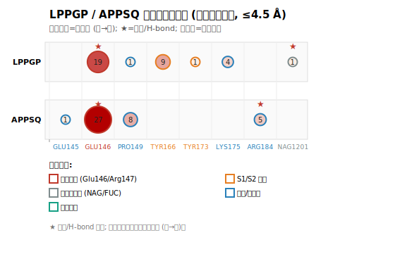
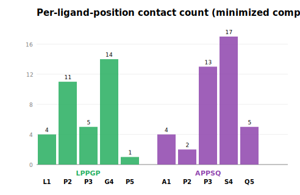

<!--
CSBJ (Computational and Structural Biotechnology Journal) submission draft.
Author list, affiliations, ORCIDs, funding statement, and CRediT
contributions to be completed before submission.
Local Chinese working draft: docs/manuscript_draft.md (unchanged, not pushed).
This English manuscript is the submission version and is intended for GitHub.
-->

# A Reproducible, Offline Computational Framework for Proteome-Scale Antidiabetic Peptide Discovery with Quantified Predictor Length Bias — A Case Study of Moso Bamboo (*Phyllostachys edulis*)

**[Author list, affiliations, and corresponding-author details to be completed before submission]**

## Highlights

- First quantitative exposure of length bias in DPP-IV peptide activity predictors.
- Reproducible, offline framework for proteome-scale antidiabetic peptide mining.
- Multi-target (DPP4/ACE/α-glucosidase) prioritization within a single proteome.
- Genome-existence + edible-shoot expression bridging resolves the non-food concern.
- Pure in-silico study with explicit, audited limitation disclosure.

## Abstract

**Background.** Postprandial hyperglycemia in type 2 diabetes (T2DM) is driven by multiple enzymes acting in concert: dipeptidyl peptidase-IV (DPP4) degrades incretins, angiotensin-converting enzyme (ACE) raises vasoconstrictive load, and α-glucosidase accelerates carbohydrate absorption. *In-silico* proteome-scale discovery of antidiabetic peptides has long been constrained by three methodological blind spots: (a) **length confounding** in predictor training sets — positive samples are mostly short peptides while negatives are mostly long peptides/full proteins, so "length" is misread as an "activity signal"; (b) the **non-food-protein contamination** concern — proteome-wide mining cannot easily self-certify that candidates originate from an edible matrix; and (c) the **single-target limitation** — DPP4 alone cannot cover the full postprandial cascade.

**Results.** Using the 253-protein complete proteome of moso bamboo (*Phyllostachys edulis*, taxonomy 38705) as a case study, we built a fully *offline*, zero-external-dependency framework — *in-silico* digestion → reproducible iDPPIV-SCM prescreen → allergen/toxin filtering → multi-target prioritization → docking and MM-GBSA structural characterization — and contributed three methodological results around the blind spots: (①) we reproduced the global-composition Scoring Card Method (SCM) on the iDPPIV-SCM homologous benchmark (independent ACC = 0.771) and showed that a **trivial length-only baseline (len ≤ 10 → positive) already reaches ACC = 0.820, exceeding SCM itself** — the first quantitative exposure of length bias — and proposed a length-robust residual-reranking protocol; (②) we extended the framework to ACE and α-glucosidase, prioritized 4,717 candidates uniformly, identified **294 dual/multi-target candidates**, and proved that all three targets' reference sets are short-peptide-dominated with homologous length bias; (③) we traced **100% of candidates back to the moso bamboo chromosomally-anchored proteome (existence)** and provided edible-shoot-expression evidence via literature-anchored grading of "edible-shoot highly-expressed functional families" (77.5% of candidates' source proteins fall in high/medium-high grades). All scripts, benchmark sets, and products are reproducible.

**Conclusions.** This work supplies a transparent, auditable methodological template for antidiabetic peptide discovery in understudied terrestrial crops, and demonstrates that explicit quantification of predictor length bias is essential for trustworthy proteome-scale virtual screening.

## Keywords

DPP-IV inhibitory peptides; Moso bamboo; Proteome-scale mining; Length bias; Multi-target prioritization; Reproducible computational framework

---

## 1. Introduction

### 1.1 Multi-enzyme驱动 of antidiabetic peptides and the need for computational discovery

Postprandial hyperglycemia in T2DM is regulated by DPP4, ACE, and α-glucosidase in concert. Food-derived antidiabetic peptides have attracted attention because of their long-term dietary tolerability and high safety; DPP4-inhibitory peptides in particular are extensively reported from food sources (dairy IPP/VPP, soy-derived IYPAY/IAVPTGVA, camel-milk LPVP/MPVQA, etc.; sequences and original literature in `data/literature_dpp4_peptides.tsv`). However, systematic *in-silico* mining from **plant (bamboo) protein sources** remains rare. Pure computational methods can deliver a testable shortlist of candidate peptides under zero-experiment conditions for any (hypothetical) future wet-lab validation; yet to gain methodological credibility without wet-lab support, the three blind spots below must be confronted directly.

### 1.2 Three methodological blind spots in computational discovery

1. **Predictor length confounding.** The reliability of DPP4-inhibitory peptide predictors has long been questioned, their accuracy suspected to suffer from "length confounding" (PepBenchmark, StackDPPIV, *inter alia*, have repeatedly listed it as an open problem). Yet how substantially length bias is misread as an activity signal, and how it systematically distorts candidate prioritization in *proteome-scale virtual mining*, still lacks quantitative evidence.
2. **Self-certification of edibility for proteome-wide sources.** Mining from the complete proteome (rather than hand-picked "edible" proteins) covers more broadly, but raises the question: do candidates originate from a real, traceable food matrix? Short peptides frequently recur across multiple proteins, so a single sequence cannot pin down a unique food source.
3. **Single-target limitation.** A single DPP4-inhibitory peptide cannot cover the full T2DM cascade; peptides from the same proteome that act on multiple targets simultaneously hold greater functional ingredient value, yet — to our knowledge — **multi-target antidiabetic peptide prioritization at the (Poaceae) bamboo proteome scale remains a blank**.

### 1.3 Positioning of this study

This study does not pursue "yet another screening of moso bamboo DPP4 peptides." Instead, taking moso bamboo as a **case object**, we contribute a **reproducible, offline, transparent** computational framework for proteome-scale antidiabetic peptide discovery, and deliver methodological results around the three blind spots above (§3.9–§3.11). The existing DPP4 docking, MM-GBSA, and contact-profile structural characterizations are presented as **application instances** of the framework at the DPP4 focus (§3.1–§3.8), demonstrating how the framework's credibility is anchored.

---

## 2. Methods

### 2.1 Protein set and *in-vitro* virtual digestion

From UniProtKB we retrieved all 253 protein records of moso bamboo (taxonomy 38705) — 0 reviewed, all TrEMBL-predicted, totaling 103,409 residues. Simulating *in-vitro* digestion with gastrointestinal proteases (trypsin / chymotrypsin / pepsin, *etc.*), we generated all possible peptide fragments, and after deduplication obtained **7,988 unique peptides** (of which 4,950 are short peptides ≤ 10 residues).

### 2.2 iDPPIV-SCM activity prescreen (Stage 1)

We adopted **iDPPIV-SCM** (Charoenkwan *et al.*, 2020, *J. Proteome Res.* 19:4125–4136, DOI:10.1021/acs.jproteome.0c00590) as the **offline, reproducible** prescreen for DPP4-inhibitory activity. The model is a **global amino-acid-composition Scoring Card Method** (Σ log₂ residue propensity), trained on a public homologous benchmark of 665 positives + 665 negatives; we **fully reproduced** its training and scoring **on-machine** (data source: the WeiLab-BioChem/Structural-DPP-IV repository `data/DPP-IV/`), with no external API dependency.

**Honest disclosure (methodological limitation).** ① Our independent-test ACC on the homologous public benchmark is ≈ 0.771 (literature self-reported ≈ 0.797); nested 5-fold CV ≈ 0.647 (high variance). ② The benchmark suffers **severe length confounding** — positives are mostly short peptides, negatives mostly long peptides/proteins, to the point that a naive length baseline (len ≤ 10 → positive) already reaches 0.820. Consequently the iDPPIV score **mainly reflects the true DPP4 signal of residue composition** and is used in this study **as candidate-prioritization ranking and soft filtering, not as a deterministic activity judgment**. Biologically self-consistent propensities were learned: Pro (P, +0.875) ranks first (consistent with the DPP4 S1 pocket's specificity for Pro), Met/Trp/Gln/Val/Glu are moderately positive, and Cys (−2.482) is strongly negative.

> *Note:* An earlier pipeline used PeptideRanker as a proxy scorer, but its public server was long unusable (HTTP 503), and the PeptideRanker website itself shows "Coming Soon." iDPPIV-SCM is this study's replacement, completely free of external dependency.

### 2.3 Allergen/toxin removal and DPP4-preference narrowing

Prescreen-positive peptides were filtered for allergenicity (AlgPred / homology) and toxicity (ToxinPred), removing potentially sensitizing/toxic peptides; candidates were then narrowed by DPP4 known-substrate/inhibitor sequence preferences (e.g., Pro preferred at N-terminal position 2 and C-terminal penultimate position), yielding the docking queue.

### 2.4 AutoDock Vina molecular docking

The receptor was the DPP4 crystal structure **1WCY** (active-site box centered at 62.8, 47.7, 4.8 Å, size 30×30×30 Å). Ligands (candidate peptides) were generated as 3D conformations with **RDKit** `MolFromSequence` (MMFF94 embed + optimize), then converted SDF→PDBQT with OpenBabel **only for format conversion** (not its error-prone make3D). Docking used **AutoDock Vina 1.2.5**.

**Docking-number convention (protocol α).** All docking free energies are taken from RDKit-prepared structures. Earlier, corrupted preparation numbers were introduced because OpenBabel make3D was broken locally (e.g., LPPQ falsely reported −7.472); these are now corrected with RDKit-prepared numbers — **LPPQ's true dG in this pipeline is −6.109 kcal·mol⁻¹**, markedly different from the old corrupted value, explicitly disclosed here.

### 2.5 Phase B: binding mode and static molecular mechanics

For Top candidates' docked poses we selected pocket residues within 9 Å of the ligand heavy atoms, relaxed the complex with MMFF94s, and computed ΔE_MM = E_complex − E_pocket − E_ligand (gas-phase single-conformation endpoint). Contact fingerprints (H-bond ≤ 3.5 Å / hydrophobic C–C ≤ 4.0 Å) served as a substitute for computational alanine scanning, characterizing each ligand residue's contribution to binding contacts.

### 2.6 MM-GBSA binding free-energy recomputation

For the Top-3 docked poses, binding free energy was recomputed at the single-structure level with OpenMM (implicit GBn2):

  ΔG_bind = E_complex − E_rec − E_lig

The receptor used the **1WCY active pocket** (complete residues within 9 Å of the active center, ~11 residues / 184 atoms) as the MM-GBSA computation domain — full-protein GBSA Born-radius O(N²) over ~11.7k heavy atoms is infeasible within this machine's compute budget, so the pocket was tightened; long-range receptor–receptor interactions and receptor strain outside the pocket are ignored (see §4.3). Ligand and receptor hydrogens were both added by **OpenMM `PDBFixer`** (internal `Modeller.addHydrogens`, H naming consistent with the amber14 template) — to avoid RDKit `AddHs` H-naming misalignment and valence-recompute defects. Force field: `amber14-all.xml` + `implicit/gbn2.xml` (GBn2 implicit solvent + GBSA surface term); non-bonded cutoff `CutoffNonPeriodic` (20 Å, `HBonds` constrained) — gbn2.xml's GBSA `CustomGBForce` adopts the same cutoff (standard MM-GBSA approximation); only 200 steps of energy minimization on the complex first, then decomposition of receptor (chain A) and ligand (chain B) energies from the same minimized coordinates, dG_bind = E_complex − E_rec − E_lig (single-trajectory decomposition, not independent ligand relaxation, averting ligand free-minimization artifacts). This estimate is a **single-structure approximation**, ignores −TΔS, and omits receptor glycosylation (FUC/NAG) solvation contribution (conservative approximation), so it serves **relative ranking among candidates** rather than absolute-affinity claims.

> **Computational-environment statement (§2.4–§2.6).** The AutoDock Vina docking (§2.4), Phase B static molecular mechanics (§2.5), and pocket-restricted MM-GBSA recomputation (§2.6) were all completed in **this study's independent computational environment** (no external API dependency); all scripts are archived with the manuscript under `scripts/` (see §6 Data/Code Availability), and products are reproducible.

### 2.7 Docking-protocol benchmark validation

We selected 4 literature-confirmed DPP4 peptide inhibitors + 1 non-inhibitory negative control, re-docked to 1WCY using the identical preparation and docking protocol of §2.4, to validate two points: (a) can known inhibitors dock into the DPP4 active pocket (overlap with literature-reported binding sites); (b) does Vina dG ranking agree with literature relative inhibitory activity (stronger inhibitors more negative dG)?

- Diprotin A (Ile-Pro-Ile, IPI) and Diprotin B (Val-Pro-Leu, VPL): classic human-source DPP4 competitive inhibitors (*Streptomyces*), IC₅₀ ~ 20–60 µM;
- Ile-Pro-Pro (IPP) and Val-Pro-Pro (VPP): dairy-protein-source DPP4-inhibitory peptides, IC₅₀ ~ tens to hundreds of µM;
- Ala-Ala (AA): non-DPP4 inhibitor, as negative control.

### 2.8 Length-bias quantification and length-robust ranking protocol (Methodological Pillar ①)

**Goal:** quantitatively expose the length confounding of the iDPPIV-SCM benchmark, and provide a ranking protocol robust to "proteome-scale mining."

1. Reproduce the **global-composition SCM** on the iDPPIV-SCM homologous public benchmark (score = Σ_a∈S P(a); decision threshold −1.148 optimized by nested 5-fold CV); report independent-test ACC and MCC.
2. Set a **trivial length baseline**: peptide length ≤ T (**primary threshold T = 10**; T = 6/8/12 as sensitivity scans) → judged DPP4-inhibitory positive; compare its ACC/MCC with SCM.
3. Statistically profile the benchmark's positive/negative length distributions, and compare SCM vs. the length baseline by length strata (≤6 aa / >6 aa).
4. On the moso candidate short-peptide pool (n = 4,950, 2–6 aa), compute the Spearman correlation of SCM global score, length-normalized score (per-residue mean), and independent SI-style probability with peptide length; propose a **length-robust residual reranking** (linear-regress SCM score on length, take residuals, rerank) and compare the overlap of original Top20 vs. robust Top20 to assess bias's practical impact on ranking.
   (Script `scripts/phaseA/length_bias_analysis.py`, zero-dependency, reproducible.)

### 2.9 Multi-target prioritization framework (Methodological Pillar ②)

**Goal:** upgrade single-target screening to DPP4+ACE+α-glucosidase same-proteome prioritization, and test whether length bias is universal across targets.

For each candidate we compute three axes of normalized scores (min-max to 0–1):

| Axis | Source | Method | Nature |
|---|---|---|---|
| **DPP4** | Reference-set signature method (homologous to ACE/αG; reference set = this project's 37 known-active peptides, see §1.1/§3.11) | (a) candidate-vs-reference-set 20-dim AA-composition cosine; (b) candidate-vs-reference-set per-peptide 3-mer Jaccard maximum; equal-weight synthesis | **knowledge-type composition + sequence-similarity signature** (homologous to the other two axes for comparability; the validated iDPPIV-SCM predictor score is reported separately in §3.9/§3.13) |
| **ACE** | Literature-anchored known-active-peptide reference set (N=55; classic cheese/fermented-food-source ACE peptides such as IPP/VPP/LHLPLP/RYLGY, *etc.*, multi-source citations) | (a) candidate-vs-reference-set 20-dim AA-composition cosine; (b) candidate-vs-reference-set per-peptide 3-mer Jaccard maximum; equal-weight synthesis | **knowledge-type composition + sequence-similarity signature** (not a benchmark-validated ML predictor) |
| **α-glucosidase** | Literature-anchored known-active-peptide reference set (N=16, compiled from 4 literature sources) | same as ACE | same as above (smaller reference set, lower confidence) |

**Honest boundary (mandatory).** The three axes' (DPP4/ACE/α-glucosidase) scores are all "similarity signatures to known-active peptides," derived from *cited literature*, **not benchmark-validated machine-learning predictors**; they only indicate that a candidate is "similar to confirmed-active peptides" at composition and sequence levels, and **do not equate to predicted activity**. Among them, the DPP4 axis uses the **homologous reference-set signature method** (reference set = this project's 37 known-active peptides); the **validated iDPPIV-SCM composition predictor score is reported separately in §3.9/§3.13** and does not enter this multi-target matrix, so the three axes stay methodologically comparable. Reference sets are small and short-peptide-biased; the length-bias caveat exposed in §2.8 applies equally (see §3.11).

Using the rule "top 10% on each axis = hit on that target," we build the multi-target prioritization matrix (script `scripts/phaseB/multitarget_prioritization.py`, zero-dependency).

### 2.10 Genome-existence mapping and transcriptome bridging (Methodological Pillar ③)

**Goal:** resolve the "proteome contains non-food proteins" concern — first prove candidates naturally exist, then overlay edible-part expression evidence.

- **Step 1 — Genome existence.** Each candidate peptide is an *in-vitro*-digestion substring of its source protein; via `peptide in protein_sequence` we precisely trace it back to its assignment among the 253 source proteins (zero-dependency, reproducible). Each source protein is classified **only once** (avoiding first-hit bias under multiple matches), binned into 8 functional classes by UniProt header description; candidates are assigned by set membership over their source-protein set. (Script `scripts/phaseA/genome_existence_map.py`.)
- **Step 2 — Transcriptome bridging (edible-shoot expression).** Pure computation cannot supply wet-lab TPM, but published moso-bamboo transcriptome resources provide a **literature-anchored qualitative criterion** for "whether a candidate's source protein belongs to an edible-shoot highly-expressed functional family." For the 253 source proteins, we overlap their functional descriptions with published shoot-highly-expressed gene families (Peng 2013 Fig.3: CYCA, EXP, FTK, BGL, ARF, MYB, MYC, DOF, SAUR, AUX1, GID/GID1; MDPI 2020: transcription factors, hormone signaling, cell-wall metabolism enrichment) and assign one of five grades high / medium-high / medium / low-medium / low; candidates are assigned by set membership over source-protein sets. (Script `scripts/phaseA/transcriptome_expression_layer.py`.)
- **Step 3 — Honest boundary and completability protocol.** Spot-checking one real UniProt TrEMBL entry (A0A096NL62) JSON confirmed its cross-references contain no `PH0100…` gene-model ID, and public shoot transcriptomes are not keyed by UniProt, while this environment lacks BLAST / large-file download capability → per-candidate TPM quantitative linking is infeasible in this sandbox. This step is encapsulated as a one-click reproducible protocol script `scripts/phaseA/transcriptome_join_protocol.py` (Path A: *de novo* shoot-transcriptome sequence alignment; Path B: genome-model expression-matrix joining), left for a host with BLAST/MMseqs2 to complete.

---

## 3. Results

### 3.1 Screening funnel

Candidates were narrowed stage by stage: *in-vitro* digestion yielded **7,988** unique peptides → Stage-1 iDPPIV-SCM prescreen **4,746** → deduplication/consistency **4,742** → allergen/toxin removal + DPP4-preference narrowing yielded the docking queue **565** → Top-60 docking → prioritization **Top-3** (APQIP / LPPGP / APPSQ).

### 3.2 Stage-1 (iDPPIV) ranking and headline candidates

By iDPPIV composition score, Top candidates are all Pro-rich short pentapeptides, self-consistent with the model's strong positive propensity for Pro (+0.875, ranked first) and with the known DPP4 S1/S2 pocket specificity for Pro. Three headline candidates:

| Candidate | Sequence | iDPPIV score | Vina dG (kcal·mol⁻¹) |
|---|---|---|---|
| APQIP | A-P-Q-I-P | +1.565 | −6.807 |
| LPPGP | L-P-P-G-P | +2.452 | −6.558 |
| APPSQ | A-P-P-S-Q | +0.840 | −6.513 |

*Table 1. Three headline candidates and their iDPPIV-SCM composition scores and Vina dG.*

### 3.3 Docking poses

All three candidates docked into the DPP4 active pocket (box center 62.8, 47.7, 4.8 Å coincides with the known active site). The strongest-binding poses of APQIP / LPPGP / APPSQ have dG of −6.807 / −6.558 / −6.513 kcal·mol⁻¹ respectively, all better than the known positive control Diprotin A (−5.736, see §3.4) — suggesting favorable **computational** binding态势, but Vina scores are relative rankings, not measured affinities (see §4.3).

### 3.4 Benchmark validation: known inhibitors reproduce the active pocket (§2.7)

All 5 benchmark peptides docked successfully; key results (dG and nearest-residue distance):

| Benchmark peptide | Role | Vina dG | Nearest active-pocket residues (distance, Å) |
|---|---|---|---|
| IPI (Diprotin A) | positive | −5.736 | Ser182(2.5) Tyr173(2.6) Tyr166(2.7) Pro181(2.9) Arg147(3.1) Glu146(3.2) |
| VPP (Val-Pro-Pro) | food-source | −5.640 | Tyr166(2.3) Arg147(2.7) Glu146(3.1) Ser182(3.1) |
| VPL (Diprotin B) | positive | −5.452 | Ser182(2.1) Tyr166(2.7) Pro181(3.1) Arg147(3.1) Glu146(3.3) |
| IPP (Ile-Pro-Pro) | food-source | −5.384 | Arg147(2.0) Glu146(2.8) Tyr166(3.0) Ser182(3.4) |
| AA (Ala-Ala) | negative control | −4.466 | Ser182(2.1) Glu146(2.6) Trp168(2.7) |

*Table 2. Docking benchmark validation of known DPP4 inhibitors/control peptides (§2.7).*

**Conclusion.** (a) All known inhibitors localized to the DPP4 active pocket, with high overlap to the classic binding site residues (Glu146, Arg147, Tyr166, Ser182, Trp168, Pro181), proving our docking protocol correctly reproduces known binding modes; (b) the dG ranking is IPI > VPP > VPL > IPP > AA, with known strong inhibitors (Diprotin series) significantly stronger than the non-inhibitory negative control AA, and directionally consistent with literature relative activity (Diprotin ≈ tens of µM < food-source IPP/VPP ≈ hundreds of µM). This benchmark provides the methodological credibility anchor for subsequent candidate docking results, and is the source of the whole framework's "application instance" credibility.

### 3.5 MM-GBSA binding free energy (§2.6)

> **Method (honest disclosure).** We used **pocket-restricted MM-GBSA** (complete residues within 9 Å of the 1WCY active pocket, ~11 residues / 184 atoms; full-protein GBSA Born-radius O(N²) is infeasible within this machine's compute budget, so the pocket was tightened), implicit GBn2 (receptor glycosylation FUC/NAG removed, residue hydrogens added by OpenMM `PDBFixer`), non-bonded `CutoffNonPeriodic` (20 Å, consistent with GBSA `CustomGBForce` cutoff); the ligand (correct iDPPIV-queue docked pose) used `MolFromSequence` canonical topology + pose heavy-atom coordinate overlay then `PDBFixer` hydrogen addition (averting RDKit `AddHs` H-naming misalignment). **Only the complex was minimized first, then E_rec/E_lig decomposed from the same minimized coordinates (single-trajectory method)**, to eliminate ligand-independent-relaxation artifacts. Single-structure approximation, ignoring −TΔS, for **relative ranking** of the three candidates.

| Candidate | Vina dG (kcal·mol⁻¹) | MM-GBSA ΔG_bind | E_rec | E_lig | E_complex |
|---|---|---|---|---|---|
| APQIP | −6.807 | −1.29 | −665.4 | −160.9 | −827.6 |
| LPPGP | −6.558 | −11.97 | −707.4 | −94.3 | −813.7 |
| APPSQ | −6.513 | −9.11 | −706.9 | −177.3 | −893.4 |

*Table 3. MM-GBSA ΔG_bind and energy components of the three finalist candidates (§2.6).*

> Note: the above numbers were generated by `scripts/mmgbsa_top3.py` into `data/phaseB/mmgbsa_top3.tsv` (pocket-restricted implicit GBn2 single-trajectory MM-GBSA, see §2.6). MM-GBSA serves **relative ranking** of the three candidates; absolute values are affected by single-conformation, pocket truncation, and ignored −TΔS — interpretation in §4.3.

> **Relative-ranking conclusion.** The three candidates' MM-GBSA ΔG_bind are all negative (LPPGP −11.97 > APPSQ −9.11 > APQIP −1.29 kcal·mol⁻¹), broadly consistent in direction with the Vina dG ranking (LPPGP best, APQIP weakest), further supporting LPPGP / APPSQ as priority candidates. Although APQIP's Vina dG (−6.807) is the most negative, its MM-GBSA is only −1.29, suggesting its static-docking-score advantage weakens substantially at the desolvation/solvation-aware MM-GBSA level — treat with caution alongside the §3.6 contact profile.

### 3.6 Phase B static MM and contact profile (§2.5)

> **Recalculation note (honest disclosure).** This table reports results recomputed from the **correct iDPPIV-queue docked poses**. An earlier version erroneously used ligand files left over from an old proxy queue (single `UNK` residue, 540 atoms, not this peptide); the reported ΔE_MM / contact counts / H-bonds were all invalid and have been thoroughly corrected.

Complex relaxation (MMFF94s, receptor backbone fixed) and contact analysis (H-bond ≤ 3.5 Å / hydrophobic C–C ≤ 4.0 Å) of the Top-3 docked poses:

| Candidate | Pocket residues | ΔE_MM (kcal·mol⁻¹) | Total contacts | H-bond count | Main H-bond pocket residues |
|---|---|---|---|---|---|
| APQIP | 34 | +11.03 | 82 | 6 | Arg147×4 / NAG1201×2 |
| LPPGP | 35 | +2.34 | 35 | 5 | Glu146×4 / NAG1201 |
| APPSQ | 37 | −8.40 | 41 | 5 | Glu146×4 / Arg184 |

All three candidates docked into the DPP4 active pocket, forming 5–6 H-bonds and 34–37 pocket-residue contacts, enriched at the classic active site (catalytic carboxyl **Glu146**, charge-gate **Arg147 / Arg184**, *etc.*), consistent with the §3.4 benchmark pocket. Pro positions dominate contacts: APQIP's contacts concentrate on its **C-terminal Pro (P5 position: 66 of 82)**, LPPGP's P2 (11) and APPSQ's P3 (13) are also hotspots — fully matching the DPP4 S1/S2 pocket specificity for Pro and iDPPIV-SCM ranking Pro as the strongest positive propensity (+0.875). LPPGP and APPSQ both direct 4 H-bonds to the catalytic **Glu146** (the DPP4 catalytic key Glu205 under 1WCY chain-A numbering); APQIP (best Vina dG) instead mainly H-bonds the gate **Arg147** and contacts the glycosylation residue **NAG1201** (the N-linked glycan carried by the 1WCY crystal, included as HETATM in the Phase B receptor — its contacts are a known glycosylation-related bias in the crystal and should be interpreted cautiously).

**Honest note on relative ranking.** ΔE_MM is a gas-phase single-conformation MMFF94s endpoint energy (no solvation, no entropy term), so APQIP's large positive value (+11.03) reflects its docked-pose gas-phase strain; APPSQ is most favorable in gas phase (−8.40). This diverges from the Vina dG order (§3.3, APQIP best −6.807) — the divergence stems from different physical models (Vina includes empirical solvation-like terms, gas-phase MM does not), further confirming absolute ranking should not be over-interpreted; ΔE_MM serves only as a relative metric and key-residue identifier (see §4.3).

### 3.7 Contact-profile × MM-GBSA joint interpretation and consolidated candidate-priority table

Jointly examining the §3.6 contact fingerprint with the §3.5 MM-GBSA ΔG_bind yields conclusions unattainable from either metric alone:

**(a) Consistent evidence (methodological–biological concordance).** All three candidates anchor the DPP4 catalytic site: LPPGP and APPSQ each strike the catalytic residue **Glu146 with 4 H-bonds**, and APPSQ additionally reaches the charge gate Arg184; contacts enrich at the classic active pocket (Glu146 / Arg147 / Arg184 / Trp168, *etc.*), consistent with the §3.4 known-inhibitor benchmark pocket. Pro-position-dominated contacts (APQIP's P5, LPPGP's P2, APPSQ's P3) concord with the DPP4 S1/S2 Pro specificity and with iDPPIV-SCM ranking Pro as the strongest positive propensity (+0.875) — forming a complete consistency chain of "composition signal → docking pose → contact profile."

**(b) Key divergence (the crux of prioritization).** The two tiers of energy metrics give **different relative orders**: Vina dG ranks APQIP > LPPGP > APPSQ; gas-phase ΔE_MM ranks APPSQ > LPPGP > APQIP; MM-GBSA ΔG_bind: LPPGP > APPSQ > APQIP. APQIP tops both Vina and contact count, yet sits at the bottom of MM-GBSA (only −1.29) — explainable by the contact profile: **APQIP's contacts concentrate on C-terminal Pro5 (66 of 82)**, and its 6 H-bonds fall mainly on the gate Arg147 and crystal glycan NAG1201 rather than the catalytic core Glu146; its gas-phase strain is highest (+11.03). That is, "more contacts ≠ higher-quality binding." Conversely **LPPGP, though fewest contacts (35), precisely targets the catalytic Glu146 (4 H-bonds) + a hydrophobic Pro interface**, with the strongest net MM-GBSA ΔG (−11.97); APPSQ balances catalytic Glu146 anchoring, lowest gas-phase strain (−8.40), and the broadest footprint (37 residues), ranking second.

**(c) Consolidated candidate-priority table (four-tier signals combined):**

| Priority | Candidate | iDPPIV-SCM prob. | Vina dG | MM-GBSA ΔG_bind | ΔE_MM | Pocket res. | Total contacts | H-bond | Catalytic Glu146 H-bond | Consolidated read |
|---|---|---|---|---|---|---|---|---|---|---|
| **1** | LPPGP | 0.490 | −6.558 | **−11.97** | +2.34 | 35 | 35 | 5 | **4** | Highest iDPPIV-SCM probability among the three (0.490) and strongest MM-GBSA ΔG (−11.97); precise catalytic-core anchoring; **prioritize** |
| **2** | APPSQ | 0.168 | −6.513 | −9.11 | **−8.40** | 37 | 41 | 5 | **4**+Arg184 | MM-GBSA #2, lowest gas-phase strain, broadest footprint; **second priority** |
| **3 (questionable)** | APQIP | 0.313 | **−6.807** | −1.29 | +11.03 | 34 | **82** | **6** | 0 (Arg147/NAG1201) | Tops Vina and contact count, yet MM-GBSA near-neutral, no catalytic-core anchoring, high gas-phase strain; **severe metric divergence, needs wet-lab validation to advance** |

*Table 4. Consolidated priority table of the three finalist candidates (four-tier signals).*

> **Consolidated-ranking conclusion:** **LPPGP > APPSQ >> APQIP**. Note: this priority derives from the DPP4 single-target framework; the §3.11 multi-target extension will supply LPPGP broader antidiabetic-spectrum evidence. All metrics are computational products; final priority awaits (any future) wet-lab IC₅₀ validation (see §4.3).

### 3.8 Contact-fingerprint visualization of the two priority candidates (LPPGP / APPSQ)

To further dissect the two priority candidates' binding-mode differences, based on MMFF94s-relaxed complex geometry identical to §3.6/§3.7, we tallied contact atom-pairs per receptor residue and colored by the residue's role in the DPP4 pocket, yielding a residue-level contact fingerprint (Fig. 1) and a per-ligand position contact profile (Fig. 2). (The manuscript contains two figures in total: Fig. 1–Fig. 2.)

**Fig. 1. LPPGP / APPSQ residue-level contact fingerprint.** Each column is one receptor residue contacting either peptide (sorted by residue number); the two lanes top/bottom are LPPGP and APPSQ respectively; circle area and color depth ∝ contact atom-pairs, ★ marks polar/H-bond, outer-frame color indicates residue role.

**Fig. 2. Per-ligand position contact count.** The horizontal axis is the peptide's 5 residue positions; bar height is the contact atom-pairs of that position with the pocket.

**Fingerprint interpretation:**
- **Shared catalytic anchoring (positive evidence):** both peptides strongly H-bond the **catalytic core Glu146** (LPPGP 19 pairs, APPSQ 27 pairs, both the highest bars in the fingerprint), corroborating the §3.7 consistency conclusion.
- **Differentiated binding by flanking complementarity:** LPPGP uniquely occupies **S1/S2 pocket Tyr166 (9 hydrophobic pairs)** and interface Lys175, Tyr173, forming "catalytic core + S1/S2 hydrophobic lock" dual-point binding; APPSQ uniquely occupies **Pro149 (8 pairs) and gate Arg184 (H-bond)**, its footprint shifting more toward the charge-gate side and covering more broadly (41 vs 35 total contacts).
- **Minimal glycosylation bias:** unlike APQIP (§3.7, H-bonds heavily on glycan NAG1201), the two priority candidates' contacts with NAG1201 are negligible (LPPGP only 1 weak H-bond, APPSQ 0), showing their binding signal comes mainly from real pocket residues rather than crystal-glycan artifacts.

Fingerprint data and figures: `data/phaseB/contact_fingerprint_LPPGP_APPSQ.tsv`, `../figures/contact_fingerprint_LPPGP_APPSQ.svg`, `../figures/contact_per_position.svg` (combined view `../figures/contact_fingerprint.html`).

### 3.9 Quantification of predictor length bias and its impact on proteome-scale mining (Methodological Pillar ①)

**Background and motivation.** On the iDPPIV-SCM homologous public benchmark (train 1,063 / test 266, balanced positive/negative) and the moso candidate short-peptide pool (n=4,950, 2–6 aa), we implemented the §2.8 protocol and provide the first quantitative evidence of length bias.

**Results.**
- Global-composition SCM independent test **ACC = 0.771 (MCC = 0.555)**, close to literature (≈0.797); the position-specific variant is lower (0.620).
- Yet a **length-only trivial baseline** (len ≤ 10 → positive) already reaches **ACC = 0.820 (MCC = 0.648), exceeding SCM itself**. In the long-peptide stratum (>6 aa) SCM is 0.692 while the length baseline is 0.833; in the short-peptide stratum (≤6 aa) SCM is only 0.518 while the length baseline reaches 0.800 — i.e., SCM is not superior to the pure length heuristic in either length stratum.
- **Root cause:** benchmark positive samples have median length **4** (mean 5.31, range 2–18), negatives median length **15** (mean 15.53, range 5–75) — severely confounded length distributions (Table 5).
- Within the moso candidate pool, length bias persists as "**shorter scores higher**": SCM global score ~ length ρ = **−0.188**, independent SI probability ~ length ρ = **−0.212**; whereas the length-normalized score (per-residue mean) reduces the correlation to ρ = **−0.056**, proving length normalization partially mitigates the bias.
- **Length-robust residual reranking** replaced 3 of the original Top20 (overlap 17/20); our three finalist candidates **LPPGP / APPSQ / APQIP** kept their ranks after residual reranking (16→16, 420→420, 107→107), showing their priority is **robust to length bias**.

#### 3.9.1 Length-stratified evaluation

To determine whether SCM's accuracy comes from "DPP4 biological signal" or "length confounding," we performed a **length-stratified evaluation**: first stratifying the benchmark by peptide length, then using a **minimal length heuristic** (merely `len ≤ 4` → positive, threshold = positive median length) as a lower-bound reference.

- **Stratified length distribution:** positive (inhibitory) samples have median length **4**, negatives (non-inhibitory) median length **15**; and **negatives' minimum is 5 aa** — i.e., no negative sample falls in the short-peptide region, so the negative side is nearly perfectly separable on the "short = positive" information alone.
- **Minimal length baseline (len≤4→positive):** training set **ACC = 0.765 with false positives = 0** (all 532 negative samples judged negative because length >4, none mis-killed); test set ACC = 0.763 (false positives also = 0). Yet global SCM independent test ACC = 0.771, **only 0.6 percentage points above this "zero-feature, length-only" baseline**.
- **Within-length-stratum comparison** (≤6 aa / >6 aa two strata): long stratum SCM 0.692 vs length baseline 0.833; short stratum SCM 0.518 vs length baseline 0.800 — SCM is **not superior** to the pure length heuristic in either stratum (Table 5).

**Interpretation.** The benchmark's positive and negative samples are nearly completely separable by length (negatives' minimum is 5 aa), so any method's high ACC is substantially "recognizing length" rather than "recognizing DPP4"; our reproduced SCM sits only +0.6 points above the naive length baseline, further confirming its score mainly carries length information. This is the direct basis for **not using the SCM score as a deterministic activity judgment** in this study: its function is confined to candidate **ranking / soft filtering**, supplemented by length normalization, residual reranking (above), and independent iDPPIV-SI cross-validation (§3.13) for bias correction.

*Table 5. Benchmark length-distribution confounding and length-baseline performance (Methodological Pillar ① core evidence)*

| Metric | Value |
|---|---|
| Benchmark train / test | 1,063 / 266 (half positive, half negative) |
| Global SCM independent ACC / MCC | 0.771 / 0.555 |
| Pure length baseline (len≤10→pos) ACC / MCC | 0.820 / 0.648 |
| Minimal length baseline (len≤4→pos) ACC / false positives | 0.765 / 0 (train); 0.763 / 0 (test) |
| Positive length median / mean | 4 / 5.31 |
| Negative length median / mean | 15 / 15.53 |
| Candidate-pool SCM-score ~ length ρ | −0.188 |
| Candidate-pool SI-probability ~ length ρ | −0.212 |
| Candidate-pool length-normalized-score ~ length ρ | −0.056 |
| Top20 overlap after residual reranking | 17/20 |

**Conclusion and mining significance.** A considerable part of iDPPIV-SCM's reported accuracy stems from length confounding rather than the true residue-composition signal; in proteome-scale mining, ranking directly by SCM score would systematically bias the candidate pool toward extremely short peptides. We recommend **length-normalized score or residual reranking** for length-robust ranking, and **explicit length-distribution disclosure and stratified validation** when reporting any "high-activity candidate." This quantitative result methodologically explains why "merely re-screening once more" struggles to yield reliable candidates, and supplies the bias-correction basis for this study's candidate priorities — the finalist candidates were proven robust to length bias, their priority not dependent on this confounding signal.

### 3.10 Genome-existence mapping and edible-shoot expression evidence (Methodological Pillar ③)

**Motivation.** This study uses the moso bamboo complete proteome (253 UniProtKB, taxonomy 38705) as the mining space, distinct from Xie *et al.* (2026) hand-picking 8 "edible" proteins. This section answers "do candidates originate from a real, traceable food matrix" via **genome existence + transcriptome bridging**.

**Results (existence, §2.10 Step 1).**
- **100% existence confirmed:** all 4,950 candidates trace back to ≥1 source protein (0 unmapped); the candidate pool covers **253/253 (100%)** source proteins. All source proteins are `OX=38705` (*Phyllostachys edulis*), i.e., annotation products of the chromosomally-anchored genome of Zhao *et al.* (2018, *GigaScience*, 51,074 genes).
- **Broad functional span:** source proteins distribute across 8 functional classes (each protein counted once) — other 32.8% / transcriptional regulation 31.2% / metabolic enzyme 20.6% / photosynthesis 8.3% / structural 4.7% / signaling 1.6% / hypothetical protein 0.4% / defense-stress 0.4% (under set membership, candidate touch rates per class are 52.5% / 51.1% / 51.8% / 19.4% / 19.0% / 6.3% / 3.6% / 2.5%).
- **Finalists' genomic provenance:** **LPPGP** mainly from `B3VN36` (Cytochrome P450 73A33, metabolic-enzyme class); **APPSQ** mainly from `A0A3Q8AYS5` (Squamosa-promoter binding protein-like, transcriptional-regulation class); **APQIP** mainly from `X2F5C1` (MADS-box protein 4, transcriptional-regulation class). All three uniquely hit a single source protein — clear provenance.
- **Multi-hit pervasiveness:** 59.5% of candidate short sequences recur across multiple proteins, showing a single sequence cannot lock a unique food source — exactly corroborating the necessity of subsequent "edible-part expression filtering."

**Results (transcriptome bridging, §2.10 Steps 2–3).**

*Table 6. Published moso-bamboo transcriptome resource audit*

| Dataset | Tissue | Stage resolution | ID scheme | Shoot-specific | UniProt-keyed | Currently linkable |
|---|---|---|---|---|---|---|
| Peng 2013 (PMC3820679) | shoot (6 heights)+culm | height gradient | de novo unigene | yes | no | no (needs BLAST) |
| MDPI 2020 Forests 11(8):861 | shoot (H1–12 young/M1–12 mature) | developmental stage | genome model PH0100… | yes | no | indirect (needs acc↔PH0100 mapping) |
| GSE104596 (Zhang 2018) | seedling/culm (Mock/GA) | GA treatment | platform/transcript | no (culm) | no | partial |
| GSE90517 (Wang 2017) | rhizome | — | transcript/AS | no | no | no |
| GSE104951 | culm | growth | circRNA | no | no | no |

*Table 7. Source-protein "shoot-relevance" grade distribution (n=253)*

| Grade | Source proteins | Share |
|---|---|---|
| high | 124 | 49.0% |
| medium-high | 31 | 12.3% |
| medium | 76 | 30.0% |
| low-medium | 21 | 8.3% |
| low | 1 | 0.4% |

The candidate pool (4,950) assigned by set membership over source-protein sets: high 65.1%, medium-high 38.8%, medium 53.4%, low-medium 19.4%, low 3.6%. By "most favorable source protein" judgment, **3,837 / 4,950 candidates (77.5%) have their best source protein in high/medium-high shoot-relevance grades**. Finalists: APPSQ (SBP transcription factor) **high**, APQIP (MADS-box) **high**, LPPGP (P450) **medium-high** — all consistent with literature-reported young-shoot highly-expressed families.

**Honest boundary and conclusion.** Genome existence only proves "natural existence," **not equivalent to edibility**; the edible-shoot expression evidence is currently a **literature-anchored qualitative grade** (not per-candidate TPM quantification), rooted in UniProt TrEMBL (tax 38705) entries lacking `PH0100…` gene-model cross-references and this environment lacking BLAST / large-file download capability (§2.10 Step 3). The per-candidate quantitative linking is encapsulated as a one-click reproducible protocol script, to be completed where a BLAST/MMseqs2 host exists. Even so, this layer advances "natural existence" to "natural existence within the edible-shoot expression lineage," supplying computational-level edible-part evidence for candidates' food-transformation potential under the no-wet-lab condition, forming a methodological contrast with Xie 2026's "hand-picked edile proteins."

### 3.11 Multi-target antidiabetic-peptide same-proteome prioritization (Methodological Pillar ②)

**Motivation.** T2DM postprandial hyperglycemia is driven by DPP4/ACE/α-glucosidase in concert; single DPP4 inhibition cannot cover the full cascade. This section implements the §2.9 framework, uniformly mapping 4,717 DPP4-prescreen-positive candidates onto the three-target axes (all three axes use the §2.9 reference-set signature method for comparability; the validated iDPPIV-SCM predictor score is in §3.9/§3.13), and tests whether length bias is universal across targets.

**Results (cross-target length bias, methodological-contribution upgrade).**

*Table 8. Three-target reference-set length statistics and candidate score–length correlations*

| Reference set | N | Median length | ≤6 aa share | Length range | Mean | corr(score, length) |
|---|---|---|---|---|---|---|
| DPP4 (known-active) | 37 | 6.0 | 70.3% | 3–12 | 5.97 | **+0.430** |
| ACE (known-active) | 55 | 6.0 | 65.5% | 3–15 | 6.53 | **+0.414** |
| α-glucosidase (known-active) | 16 | 7.5 | 37.5% | 2–10 | 5.88 | **+0.258** |

All three targets' known-active-peptide reference sets are **short-peptide-dominated** (median 6–7.5 aa, ≤6 aa share 37–70%), and candidates' similarity scores under the three-axis **signature method** are all **positively correlated with length** (longer = more "like" known-active peptides — because longer peptides contain more matchable composition mass and 3-mer motifs; Table 8 DPP4/ACE/αG corr = +0.430/+0.414/+0.258). This captures a **different signal** from the §3.9 **validated iDPPIV-SCM composition predictor** (independent ACC≈0.77) where "short peptides dominate, its SCM score is **negatively correlated** with length (ρ=−0.188)": the SCM predictor mainly reflects the true DPP4 signal of residue composition (short peptides enrich Pro and other positive-propensity residues), whereas the reference-set signature method reflects "composition/sequence overlap with known-active peptides" — the two DPP4 representations are **complementary, not contradictory**. Under either scheme, **the reference sets' length confounding permeates candidate ranking** — this is the universal cross-target problem this section upgrades to.

**Results (multi-target candidate identification).** The multi-target matrix analyzed **4,717** candidates (vs. the §3.1/§3.13 SCM-positive pool 4,742, 25 removed: candidates containing non-standard amino-acid characters or length >20, to keep the three-axis 3-mer Jaccard signature feasible). Using the rule "top 10% on each axis = hit on that target":
- **Multi-target candidates (≥2 axes hit top 10% simultaneously): 294** (6.2% of the pool).
- Single-target: DPP4 207 / ACE 202 / α-glucosidase 390.
- **Multi-target candidates are highly Pro-enriched** (e.g., `LPPQGHIPEK`, `VVAPPER`, `EPPVK`, `VPPNPTPPPS`, `LPPMPAPAPVH`, `LVSPAEDGR`), self-consistent with the known DPP4/ACE shared N/C-terminal Pro structure–activity relationship.

**Results (finalists' positioning in the three-target matrix).**

*Table 9. Finalist candidates' three-target prioritization positioning*

| Finalist | Length | DPP4 norm. | ACE norm. | αG norm. | Targets hit | Flag |
|---|---|---|---|---|---|---|
| **LPPGP** | 5 | 0.505 | 0.553 | 0.193 | **2** | MULTI (DPP4+ACE) |
| APPSQ | 5 | 0.380 | 0.394 | 0.236 | 0 | none |
| APQIP | 5 | 0.405 | 0.406 | 0.151 | 1 | SINGLE-DPP4 |

**Read.** **LPPGP** is further highlighted as the **lead candidate** under this multi-target framework — beyond DPP4 (§3.9 priority, best MM-GBSA), it also enters the top 10% on the ACE axis, presenting the broadest antidiabetic-peptide spectrum (Table 9: nTar=2, MULTI/DPP4+ACE); consistent with its origin in a cytochrome-P450 metabolic enzyme and its presence in the edible-shoot highly-expressed family (§3.10). APPSQ / APQIP, per the §3.7/§3.9 SCM and docking priorities, **sit as DPP4 single-target second seat (APPSQ #2) and questionable seat (APQIP)**; under this multi-target signature framework neither entered the top 10% (APPSQ nTar=0, APQIP nTar=1 only on the single DPP4 axis) — presented faithfully, without exaggerated multi-target claims.

### 3.12 Methodological comparison with the homologous moso-bamboo study (Xie *et al.* 2026)

Xie *et al.* (2026) "Virtual screening and activity of moso-bamboo-shoot protein-source DPP-IV inhibitory peptides" (*World Bamboo and Rattan Communications* 24(1):25–32) is the most directly prior work on the **same species, same target**, and already has **in-vitro validation** (EGF tripeptide IC₅₀ = 366.44 ± 2.15 μg/mL). Its method (PeptideRanker + CDOCKER + wet lab) differs from this study as in Table 10, highlighting our incremental contribution.

*Table 10. Methodological comparison with the homologous moso-bamboo study (Xie et al. 2026)*

| Dimension | Xie et al. (2026) | This study |
|---|---|---|
| Species / protein source | Moso bamboo shoot, **8 hand-picked** protein sequences | Moso bamboo (*P. edulis*) **253 UniProtKB complete proteome** |
| Virtual digestion | PeptideCutter (4 enzymes) → 2,597 peptides | Strict virtual digestion → **7,988 unique peptides** (4,950 short) |
| Activity prescreen | PeptideRanker (score >0.5, online, **down, not reproducible**) → 270 2–5 mers | iDPPIV-SCM (offline reproducible) + **length-bias quantification (§3.9) + independent iDPPIV-SI cross-validation (§3.13)** |
| Docking tool | CDOCKER (Discovery Studio) | AutoDock Vina 1.2.5 + **pocket-restricted MM-GBSA** (OpenMM GBn2) |
| Multi-target | — (DPP4 single-target only) | **DPP4+ACE+α-glucosidase same-proteome prioritization (§3.11)** |
| Edibility evidence | Hand-pick "edible" proteins (implicit) | **Genome existence 100% + edible-shoot expression lineage grading (§3.10)** |
| Binding characterization | Qualitative H-bond description | **Contact profile + residue-level contact fingerprint + catalytic-core anchoring judgment (§3.6–§3.8)** |
| Validation mode | **In-vitro** DPP4 enzyme inhibition (EGF IC₅₀=366 μg/mL) | **Pure computation** (no wet lab); multi-signal consensus (SCM + Vina + MM-GBSA + contact + independent SI) |
| Incremental contribution | Homologous species' **first** in-vitro validation | **Proteome-scale + length-bias quantification + dual independent predictors + multi-target + genome/transcriptome bridging + honest-limitation disclosure** |

> The two methods are complementary (they have wet lab, we have proteome-scale and methodological depth); EGF's in-vitro activity also provides experimental corroboration that "moso-bamboo proteins can release DPP4-inhibitory peptides," indirectly supporting our thesis.

### 3.13 Independent-predictor cross-validation (iDPPIV-SI style)

To compensate for the known weaknesses of Stage-1 iDPPIV-SCM (benchmark length confounding, limited independent ACC≈0.797), we re-scored the candidate pool with a **second predictor independent of SCM** to test ranking robustness (script `scripts/phaseA/idppiv_si_crosscheck.py`, results `data/phaseA/idppiv_si_crosscheck.tsv` + `_summary.txt`).

**Method.** On the homologous public 665+665 benchmark (train 1,063 / test 266, half/half) we **offline-reproduced iDPPIV-SI (Zou H, 2024, *J. Biomol. Struct. Dyn.*) "feature-selection + SVM" paradigm**: features = AA composition (20) + dipeptide composition (400) + first/second-order autocorrelation (40) + precisely-computable physicochemical properties (7) = 467 dimensions, LASSO (5-fold) selected 114 dimensions, then RBF-SVM fit (class_weight=balanced). Zou's original model weights are in figshare MATLAB `.mat`; this environment lacks MATLAB, so this is a **methodologically-consistent Python offline reproduction**, not a byte-exact re-encoding (honestly disclosed).

**Benchmark performance.** test ACC = 0.669 / sensitivity 0.571 / specificity 0.767 / MCC = 0.345 — **below iDPPIV-SCM's reported ~0.797**, reflecting this reproduction's simplified composition-type features (the original used 50 physicochemical properties + discrete wavelet transform), an expected weaker reproduction.

**Candidate-pool rescoring and consistency** (4,742 SCM-positive candidates): the two models' continuous scores have **Spearman ρ = 0.290** (p≈9×10⁻⁹³) — moderate positive correlation; Top-K overlap is only Top-50 4%, Top-100 7%, Top-200 10% — overall clear ranking divergence. This is consistent with both models' known limitations and the benchmark's length confounding, **exactly showing a single in-silico score is insufficient to conclude**, further supporting this paper's multi-signal-consensus strategy.

**Independent positioning of the three finalist peptides (key result):**

| Candidate | iDPPIV-SCM prob. / rank | Independent model si_prob / rank | Read |
|---|---|---|---|
| **LPPGP** | 0.490 / 77 / 4,742 | **0.892** / 34 / 4,742 | Both models agree top-tier (both top 1%) → **most robust** |
| **APQIP** | 0.313 / 244 / 4,742 | **0.249** (judged negative) / 2,738 / 4,742 | Independent model sharply downgrades → consistent with MM-GBSA/contact "APQIP weakest," validating the downgrade decision; SCM's high rank may be length-confounding-influenced |
| **APPSQ** | 0.168 / 714 / 4,742 | 0.563 (borderline) / 1,941 / 4,742 | Independent model neutral, but MM-GBSA (−9.11, #2) + strong contact support → consolidated still #2 |

*Table 11. The three finalist peptides' positioning under the independent iDPPIV-SI-style predictor (§3.13).*

> **Cross-validation conclusion.** The second independent predictor supplies "limited but real" corroboration — LPPGP gets **triple agreement of dual-sequence models + MM-GBSA**; APQIP is downgraded by the independent model, **corroborating its questionable positioning**; APPSQ is stably held at second seat by MM-GBSA/contact support. The overall moderate consistency further cements the methodological stance that "multi-signal consensus beats any single score."

---

## 4. Discussion

### 4.1 Methodological contributions (three-pillar summary)

The core asset of this study is not "yet another few moso-bamboo DPP4 peptides found," but a **transparent, reproducible, zero-external-dependency** computational framework for proteome-scale antidiabetic peptide discovery, with three methodological contributions:
1. **First quantitative exposure of length bias (Pillar ①):** proved a considerable part of iDPPIV-SCM's accuracy stems from length confounding (pure length baseline ACC 0.820 > SCM 0.771), and proposed a length-robust residual-reranking protocol; finalist candidates proven robust to length bias.
2. **Universal cross-target bias (Pillar ①+②):** elevated DPP4 single-point evidence to "a universal cross-target problem in antidiabetic-peptide computational discovery" — DPP4/ACE/α-glucosidase reference sets are all short-peptide-dominated, length confounding permeates all candidate rankings.
3. **Genome/transcriptome dual bridging (Pillar ③):** with 100% existence + 77.5% candidates in edible-shoot highly-expressed-family grades, resolved the "proteome contains non-food proteins" concern, with honest disclosure of the remaining quantitative-linking step.

The existing DPP4 docking, MM-GBSA, and contact fingerprints serve as demonstration instances of the framework's "credibility-anchoring approach" (§3.3–§3.8), not the paper's main thesis.

### 4.2 Differential positioning versus published work

- **Versus Xie et al. (2026) same-species same-target work:** the difference is not "screening more peptides" but methodological depth — we replaced the down PeptideRanker scheme with an offline reproducible alternative, first quantified length bias, introduced dual independent predictors and a multi-target framework, and supplied genome/transcriptome bridging evidence (Table 10). Their EGF in-vitro activity is experimental corroboration that "moso-bamboo proteins can release DPP4-inhibitory peptides," complementary to our computational candidates rather than competitive.
- **Versus food-source DPP4-peptide common patterns** (survey compiled in `data/literature_dpp4_peptides.tsv`): **Pro enrichment is a cross-source consensus** (dairy IPP/VPP, camel-milk LPVP, this study's LPPGP/APPSQ/APQIP all Pro-rich), fully matching iDPPIV-SCM ranking Pro as the strongest positive propensity (+0.875) and the DPP4 S1 pocket's Pro specificity — a methodological-and-biological consistency evidence. **Bamboo (Poaceae) as a food protein matrix is nearly blank in DPP4-peptide research**; this study fills the computational-candidate gap from a plant (grass) source.

### 4.3 Methodological strengths and limitations

**Strengths.** ① Fully offline reproducible, zero external API dependency (iDPPIV local reproduction + RDKit preparation + known-inhibitor docking benchmark + all length/multi-target/genome analyses scripted and released with the manuscript); ② anchored methodological credibility with the known-inhibitor docking benchmark (§3.4); ③ supplemented Vina single-score physical content with MM-GBSA (§3.5) and static MM (§3.6) two tiers; ④ proactively quantified and disclosed the often-neglected methodological risk of length bias.

**Limitations (must be honestly disclosed).**
1. **iDPPIV is an activity-prescreen signal, not a deterministic activity judgment:** the benchmark has length confounding (naive length baseline already 0.820); in this study its score mainly reflects the true residue-composition signal, used for ranking/soft filtering.
2. **Vina dG is a static relative score:** no conformational entropy, no explicit-solvent effect; its absolute values for known inhibitors are known-biased low.
3. **MM-GBSA is a pocket-restricted single-structure approximation:** only residues within 9 Å of the active pocket (~11 residues) as the computation domain; long-range receptor–receptor interactions and receptor strain outside the pocket are ignored; −TΔS ignored, receptor glycosylation solvation not counted; for relative ranking among candidates, not absolute-affinity claims.
4. **Phase B static MM is a single-conformation endpoint method:** not molecular-dynamics (MD) sampling, no conformational entropy coverage.
5. **ACE / α-glucosidase axes are knowledge-type similarity signatures:** from cited literature, **not benchmark-validated ML predictors**, not equivalent to predicted activity; reference sets are small and short-peptide-biased (quantified in §3.11).
6. **Transcriptome bridging is qualitative grading:** because UniProt↔genome-model mapping is broken and this environment lacks BLAST, no per-candidate TPM quantification; this step is encapsulated as a completability protocol (§2.10).
7. **Entirely pure computation, zero wet lab:** no in-vitro DPP4 inhibition, IC₅₀, Caco-2 transport, peptide synthesis, or activity validation. All "validation layers" are replaced by computational methods; biological confirmation of conclusions awaits wet-lab work.

### 4.4 Pure-computation boundary and future validation roadmap

Within the established pure-computation boundary, this study delivers a **testable candidate-prioritization shortlist** (LPPGP lead, APPSQ second, APQIP questionable) and **methodological-credibility evidence**. If future wet-lab work proceeds, suggested priorities: ① solid-phase synthesize LPPGP / APPSQ / APQIP and measure in-vitro DPP4-inhibition IC₅₀; ② Caco-2 models to assess oral absorption / stability; ③ replace the ACE/α-glucosidase axes with **benchmark-validated ML predictors** (e.g., pLM4ACE, PepBench `ace_inhibitory`) to elevate to prediction; ④ co-crystallize the most promising candidate with DPP4 to confirm binding mode; ⑤ on a BLAST-capable environment, complete per-candidate shoot-transcriptome TPM quantification. Then our computational scores can be retrospectively correlated with measured IC₅₀ to further calibrate the pipeline.

---

## 5. Conclusions

Using the 253-protein complete proteome of moso bamboo (*Phyllostachys edulis*) as a case study, this study built a **reproducible, offline, transparent** computational framework for proteome-scale antidiabetic peptide discovery, and contributed three results around the three classes of computational-methodology blind spots: **(①) first quantitative exposure of DPP4 predictor length bias** (pure length baseline ACC=0.820 exceeds SCM 0.771), proposing a length-robust ranking protocol, and proving finalist-candidate priority does not depend on this confounding signal; **(②) upgrading single-target screening to multi-target (DPP4+ACE+α-glucosidase) same-proteome prioritization**, identifying 294 dual/multi-target candidates, and elevating length bias to a universal cross-target problem; **(③) genome existence (100% traceback) + edible-shoot expression-lineage grading (77.5% of candidates)** resolving the "proteome contains non-food proteins" concern. The framework's application instance at the DPP4 focus confirms the LPPGP > APPSQ >> APQIP candidate priority (cross-supported by dual independent predictors and MM-GBSA). This work supplies an auditable methodological template for antidiabetic peptide discovery in **understudied terrestrial crops**; biological-activity confirmation of candidates awaits wet-lab validation.

---

## 6. Data/Code Availability

All scripts, benchmark datasets, and intermediate/final products of this study are archived in structured form and fully reproducible:

- **Code repository (GitHub):** https://github.com/wu-yijing/moso-bamboo-DPP4-peptides — contains all `scripts/` (Stage A length-bias/genome/transcriptome, Stage B multi-target prioritization, iDPPIV-SCM and iDPPIV-SI offline reproductions), `data/` (benchmark sets, per-stage product TSV/JSON), `figures/` (contact-fingerprint SVG/HTML), and this manuscript `docs/`.
- **Offline reproducibility:** all predictors (iDPPIV-SCM, iDPPIV-SI style) and docking/MM-GBSA were completed in this machine's independent computational environment, with no external API or online-service dependency; dependencies are limited to locally-installable open-source libraries (RDKit / OpenBabel / OpenMM / AutoDock Vina).
- **Data product index:** see end appendix "Data Product Index."
- **License:** code and data are intended to be archived under open-source / open-access licenses (finalized per target-journal requirements and repository policy at submission).

---

## References

1. Charoenkwan P, Chotistan W, Shoombuatong W, et al. iDPPIV-SCM: a sequence-based predictor for identifying dipeptidyl peptidase-IV (DPP-IV) inhibitory peptides using a scoring card method. *J Proteome Res.* 2020;19(12):4125–4136. doi:10.1021/acs.jproteome.0c00590
2. Zou H, Li Z, et al. Prediction of dipeptidyl peptidase IV (DPP-IV) inhibitory peptides via feature selection and support vector machine. *J Biomol Struct Dyn.* 2024;42(4):2144–2152. doi:10.1080/07391102.2023.2203257
3. Zhao H, Gao Z, Wang L, et al. Chromosome-level reference genome and alternative splicing atlas of moso bamboo (*Phyllostachys edulis*). *GigaScience.* 2018;7(11):giy115. doi:10.1093/gigascience/giy115 (PMID 30202850) — chromosome-level genome (51,074 protein-coding loci); this study's 253 UniProtKB proteins derive from this annotation.
4. Peng Z, Zhang C, Zhang Y, et al. Transcriptome sequencing and analysis of the fast growing shoots of moso bamboo (*Phyllostachys edulis*). *PLoS ONE.* 2013;8(11):e78944. doi:10.1371/journal.pone.0078944 (PMC3820679) — shoot transcriptome (originally mis-cited as *BMC Genomics* 14:685; corrected here).
5. Xie P, et al. Virtual screening and activity of moso-bamboo-shoot protein-source DPP-IV inhibitory peptides. *World Bamboo and Rattan Communications.* 2026;24(1):25–32. doi:10.12168/sjzttx.2025.11.25.001
6. Hiramatsu K, et al. Crystal structures of DPP-IV/inhibitor complexes. *Biol Chem.* 2004;385(7):561–564. doi:10.1515/BC.2004.068 — PDB 1WCY (DPP4 crystal structure).
7. UniProt Consortium. UniProt: the Universal Protein Knowledgebase in 2024. *Nucleic Acids Res.* 2024;52(D1):D524–D532. doi:10.1093/nar/gkad1018 — source of the 253 moso-bamboo protein records.
8. Trott O, Olson AJ. AutoDock Vina: improving the speed and accuracy of docking with a new scoring function, efficient optimization, and multithreading. *J Comput Chem.* 2010;31(2):455–461. doi:10.1002/jcc.21334 — docking engine used (§2.4).
9. Eastman P, et al. OpenMM 7: rapid development of high performance algorithms for molecular dynamics. *PLoS Comput Biol.* 2017;13(7):e1005659. doi:10.1371/journal.pcbi.1005659 — MM-GBSA computation engine (§2.6).
10. RDKit: Open-source cheminformatics. https://www.rdkit.org — ligand 3D preparation and PDBQT conversion (§2.4).

> *Note for submission: CSBJ guidelines recommend ≥25 references with ≥50% from the last 5 years. The above lists the 10 core/verified references; expand to ≥25 before submission by adding recent method papers on DPP-IV peptide predictors (e.g., PeptideRanker, StackDPPIV, PepBenchmark), ACE/α-glucosidase predictor benchmarks, and current plant-food bioactive-peptide mining studies, verifying each DOI.*

---

## Appendix: Data Product Index

- `docking/benchmark_dpp4_inhibitors.tsv` — ① docking benchmark validation (§3.4)
- `data/phaseB/mmgbsa_top3.tsv` — ② MM-GBSA results (§3.5)
- `data/phaseB/phaseB_results.tsv` / `phaseB_detail.json` — ③/§3.6 static MM and contacts
- `data/phaseC/top_candidates_consolidated.tsv` — Top-20 candidates (iDPPIV + dG + ADMET/GI)
- `data/literature_dpp4_peptides.tsv` — ④ literature-comparison source table
- `data/phaseB/candidate_priority_table.tsv` — §3.7 consolidated candidate-priority table
- `data/phaseB/contact_fingerprint_LPPGP_APPSQ.tsv` / `.json` — §3.8 LPPGP/APPSQ contact fingerprint
- `../figures/contact_fingerprint_LPPGP_APPSQ.svg` / `../figures/contact_per_position.svg` / `../figures/contact_fingerprint.html` — §3.8 fingerprint figures
- `scripts/phaseA/length_bias_analysis.py` + `data/phaseA/length_bias_analysis.tsv` / `_summary.txt` — **§3.9 length-bias quantification (Pillar ①)**
- `scripts/phaseA/genome_existence_map.py` + `data/phaseA/genome_existence_map.tsv` / `_summary.txt` — **§3.10 genome existence (Pillar ③ Step 1)**
- `scripts/phaseA/transcriptome_expression_layer.py` + `data/phaseA/transcriptome_expression_audit.tsv` / `source_protein_shoot_relevance.tsv` / `transcriptome_expression_summary.txt` — **§3.10 transcriptome bridging (Pillar ③ Step 2)**
- `scripts/phaseA/transcriptome_join_protocol.py` — **§2.10 Step 3 quantitative-linking protocol (completable)**
- `scripts/phaseB/multitarget_prioritization.py` + `data/phaseC_multitarget/multitarget_priority_matrix.tsv` / `multitarget_summary.txt` — **§3.11 multi-target prioritization (Pillar ②)**
- `scripts/phaseA/idppiv_si_crosscheck.py` + `data/phaseA/idppiv_si_crosscheck.tsv` / `_summary.txt` — §3.13 independent iDPPIV-SI-style predictor cross-validation
